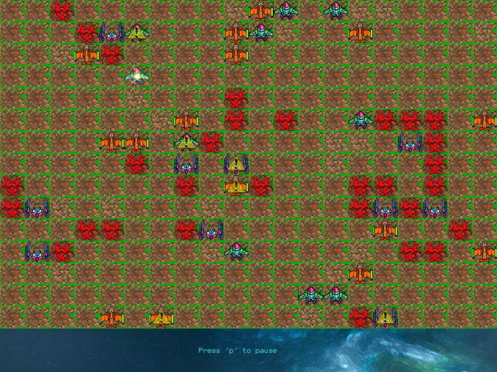

# PlanetX

PlanetX is a mining simulation game built in C++ with the OpenGL Utility Toolkit (GLUT).

## Installation

Install GLUT in Visual Studio:
1. Download the pre-compiled [GLUT binaries](https://www.opengl.org/resources/libraries/glut/glutdlls37beta.zip).
2. Go to your Visual Studio installation path `C:\Program Files (x86)\Microsoft Visual Studio **.0\VC`.
3. Copy all *.lib files to lib folder, all *.h files to the include folder and *.dll to the bin folder.

## Description

There are three types of robots / vehicles in the mini-game:

1. Exploration

    Their role is to explore the map and find dangerous spots. These spots are flagged as dangerous and are inaccessible by other robots.

2. Mining

    Their role is to mine the minerals (Platinum, Iridium, Palladium) from the planet. Whenever their storage is full, they teleport to the spaceship, empty their storage and then teleport back to the planet.

3. Rescue

    Their role is to locate damaged robots and fix them.

## How to play

The purpose of the game is for the spaceship to gather all the required minerals. You can either sit back and enjoy the game unfold on its own, or pause the game by pressing `p` and add robots, destroy them, edit their capabilities or change the map's minerals.

## Screenshots

